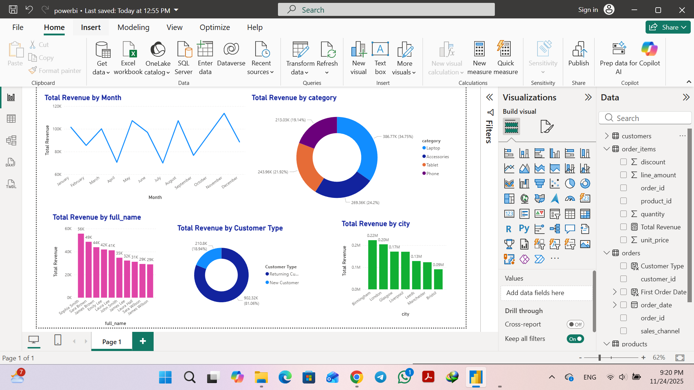
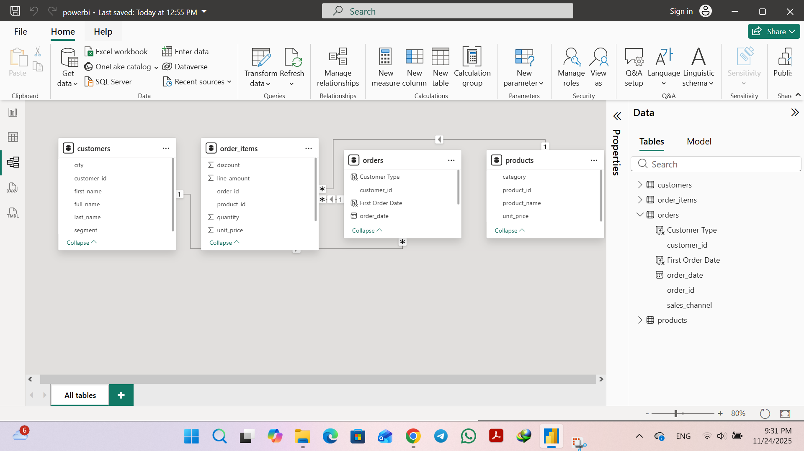
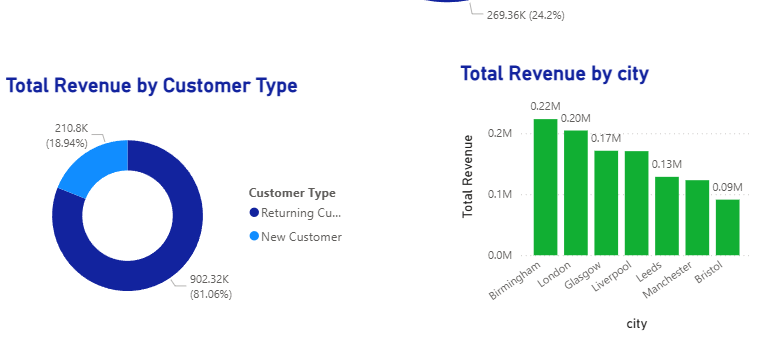

# 📊 Customer & Sales Analytics – SQL + Power BI

A complete **end-to-end data analytics project** showing how I use **SQL, Data Modeling, and Power BI** to answer real business questions about customers and sales performance.

This project is designed as a **portfolio piece for Data Analyst roles** (especially SQL + Power BI positions).

---

## 🧩 Project Overview

An online electronics store wants to understand:

- Who are our **most valuable customers**?
- Which **product categories** drive the most revenue?
- How does **revenue change over time**?
- Which **cities** perform best?
- What share of revenue comes from **new vs returning customers**?

In this project, I:

1. Designed a **relational data model** (4 tables: customers, products, orders, order_items)  
2. Built a **fact view** in SQL (`sales_fact`) for analytics  
3. Wrote **SQL KPIs** for monthly revenue, top customers, revenue by city/category, and customer behaviour  
4. Created a **Power BI dashboard** with interactive visuals

---

## 📁 Project Structure

```bash
customer-sales-sql-powerbi/
│
├── data/
│   └── raw/
│        ├── customers.csv
│        ├── products.csv
│        ├── orders.csv
│        └── order_items.csv
│
├── sql/
│   ├── schema.sql                  # Create all base tables
│   ├── sales_fact_view.sql         # Build main analytics view (sales_fact)
│   └── customer_sales_analysis.sql # KPIs & analysis queries
│
├── database/
│   └── sales.db                    # Full SQLite database with data + view
│
├── powerbi/
│   └── customer_sales_dashboard.pbix
│
├── screenshots/
│   ├── dashboard.png               # Main dashboard page
│   ├── model.png                   # Data model (relationships)
│   └── visuals.png                 # Close-up of key visuals
│
└── README.md
```

---

## 🗄️ Data Model (SQL Layer)

The analytical model is based on **4 core tables**:

- `customers(customer_id, full_name, city, segment, …)`
- `products(product_id, product_name, category, unit_price)`
- `orders(order_id, customer_id, order_date, sales_channel)`
- `order_items(order_item_id, order_id, product_id, quantity, unit_price, discount, line_amount)`

The schema can be recreated using:

```sql
-- See: sql/schema.sql
CREATE TABLE customers (...);
CREATE TABLE products (...);
CREATE TABLE orders (...);
CREATE TABLE order_items (...);
```

A unified fact view (`sales_fact`) is created to simplify analytics:

```sql
-- See: sql/sales_fact_view.sql
CREATE VIEW sales_fact AS
SELECT
    o.order_id,
    o.order_date,
    o.sales_channel,
    c.customer_id,
    c.full_name,
    c.city,
    c.segment,
    p.product_id,
    p.product_name,
    p.category,
    oi.quantity,
    oi.unit_price,
    oi.discount,
    oi.line_amount,
    oi.quantity * oi.unit_price * (1 - oi.discount) AS line_revenue
FROM orders      AS o
JOIN customers   AS c  ON o.customer_id = c.customer_id
JOIN order_items AS oi ON o.order_id    = oi.order_id
JOIN products    AS p  ON oi.product_id = p.product_id;
```

This view powers all KPIs in `customer_sales_analysis.sql`.

---

## 📊 Key SQL KPIs

All KPI queries are stored in:  
`sql/customer_sales_analysis.sql`

Examples:

### 1️⃣ Monthly Revenue

```sql
SELECT
    strftime('%Y-%m', order_date) AS year_month,
    SUM(line_revenue) AS monthly_revenue
FROM sales_fact
GROUP BY year_month
ORDER BY year_month;
```

### 2️⃣ Top 10 Customers by Revenue

```sql
SELECT
    customer_id,
    full_name,
    city,
    segment,
    SUM(line_revenue) AS total_revenue,
    COUNT(DISTINCT order_id) AS num_orders
FROM sales_fact
GROUP BY customer_id, full_name, city, segment
ORDER BY total_revenue DESC
LIMIT 10;
```

### 3️⃣ Revenue by Product Category

```sql
SELECT
    category,
    SUM(line_revenue) AS revenue_by_category,
    COUNT(DISTINCT product_id) AS num_products,
    COUNT(DISTINCT order_id) AS num_orders
FROM sales_fact
GROUP BY category
ORDER BY revenue_by_category DESC;
```

### 4️⃣ Revenue by City & Segment

```sql
SELECT
    city,
    segment,
    SUM(line_revenue) AS revenue_city_segment,
    COUNT(DISTINCT customer_id) AS num_customers
FROM sales_fact
GROUP BY city, segment
ORDER BY revenue_city_segment DESC;
```

### 5️⃣ New vs Returning Customers

```sql
WITH first_purchase AS (
    SELECT
        customer_id,
        MIN(order_date) AS first_order_date
    FROM sales_fact
    GROUP BY customer_id
)
SELECT
    CASE
        WHEN s.order_date = f.first_order_date THEN 'New Customer'
        ELSE 'Returning Customer'
    END AS customer_type,
    COUNT(DISTINCT s.order_id) AS num_orders,
    COUNT(DISTINCT s.customer_id) AS num_customers,
    SUM(s.line_revenue) AS total_revenue
FROM sales_fact AS s
JOIN first_purchase AS f
    ON s.customer_id = f.customer_id
GROUP BY customer_type;
```

These queries answer real business questions about **loyalty, segments, and profitability**.

---

## 🎨 Power BI Dashboard

The Power BI report (`powerbi/customer_sales_dashboard.pbix`) is built on top of the imported tables and relationships:

- `customers 1 ───< orders 1 ───< order_items >───1 products`

Key visuals:

- **Total Revenue** – Card
- **Monthly Revenue Trend** – Line chart
- **Top 10 Customers** – Bar chart
- **Revenue by Category** – Donut chart
- **Revenue by City** – Bar/column chart
- **New vs Returning Customers** – Donut chart

### Dashboard Preview



### Data Model (Relationships)



### Sample Visuals



---

## 🧠 Example Business Insights

*(Sample insights – will vary with actual data)*

- **Top customers** contribute a large share of total revenue, which suggests that targeted retention campaigns could be highly effective.
- **Specific product categories** (e.g. Laptops or Phones) dominate revenue, indicating where stock and marketing budgets should be prioritised.
- **City-level performance** shows that some cities consistently underperform and may need local promotions or channel optimisation.
- A significant portion of revenue comes from **returning customers**, showing the importance of customer loyalty and experience.

These insights can be extended with more advanced segmentation and cohort analysis.

---

## 🛠️ Tech Stack

- **SQL / SQLite**
  - Data modeling (4 tables)
  - Views, JOINs, GROUP BY, CTEs
- **Power BI**
  - Data modeling & relationships
  - DAX measures & calculated columns
  - Interactive dashboards
- **Git & GitHub**
  - Project structure & documentation

---

## 🚀 How to Use This Project

1. **Clone the repo**

```bash
git clone https://github.com/Forough-Moosavi/customer-sales-sql-powerbi.git
cd customer-sales-sql-powerbi
```

2. **Explore the database**

- Open `database/sales.db` with DB Browser for SQLite (or any SQLite client).
- Run queries from `sql/customer_sales_analysis.sql`.

3. **Open the Power BI report**

- Open `powerbi/customer_sales_dashboard.pbix` in Power BI Desktop.
- Refresh visuals and interact with filters, slicers, and drill-downs.

---

## 👩‍💻 About Me

**Forough S. Moosavi**  
*Data Analyst | SQL | Power BI | Excel | Python*

- Experienced in building **end-to-end analytics projects**: from data cleaning to dashboards.
- Focused on **business-oriented insights**, not just charts.
- Open to **Data Analyst / BI roles** and freelance opportunities.

📧 Email: **forooghmousavi1371@gmail.com**  
🔗 GitHub: **https://github.com/Forough-Moosavi**

---

> If you’re a recruiter or hiring manager:  
> This project is a practical example of how I would approach your data, structure it with SQL, and turn it into clear dashboards and insights with Power BI.
